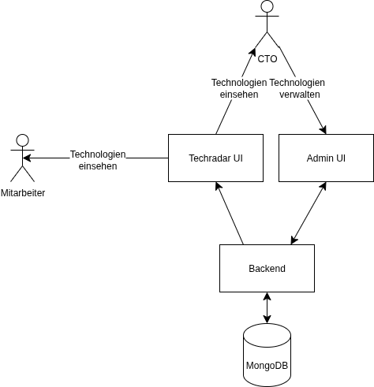
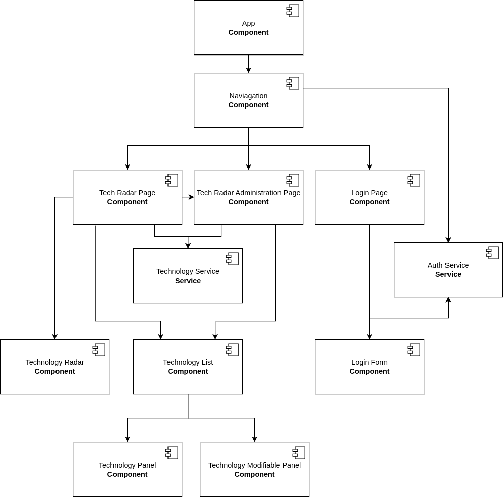
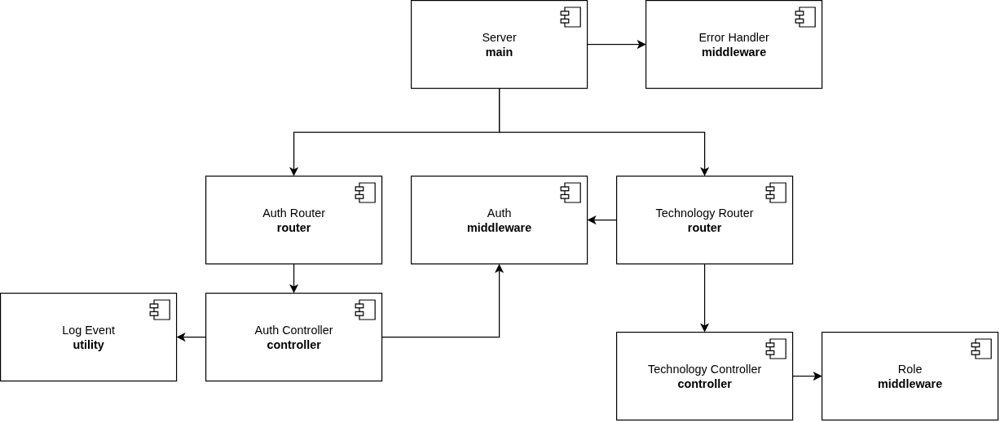
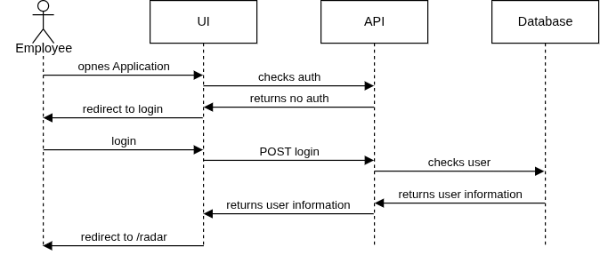
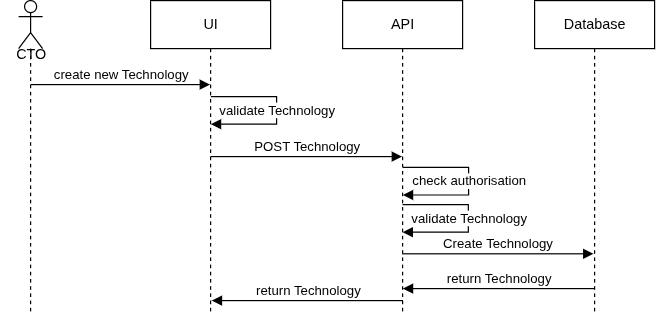
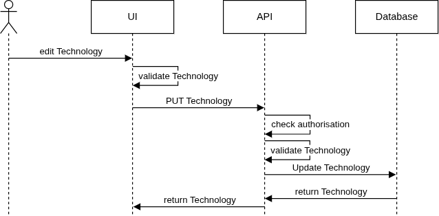
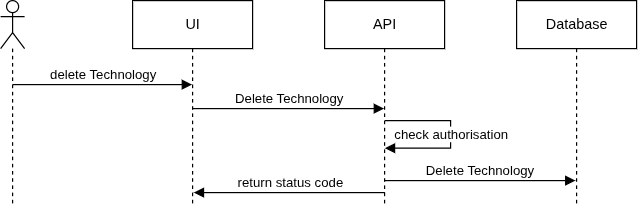

# Architekturdokumentation

## 1. Einführung und Ziele

Der Technologie-Radar soll Unternehmen, Produktteams und Software-Architekten dabei unterstützen, den Überblick über
eingesetzte und relevante Technologien zu behalten. Technologien werden dabei nach Kategorien (z.B. Tools, Platforms,
Languages & Frameworks, Techniques) sowie nach ihrem Reifegrad (Assess, Trial, Adopt, Hold) eingeordnet.

Der Nutzen liegt insbesondere darin, technologische Entscheidungen im Unternehmen nachvollziehbar, transparent und
zentral zugänglich zu machen. Mitarbeiterinnen und Mitarbeiter können sich schnell über den aktuellen Stand informieren,
während CTOs die Verantwortung für Pflege, Bewertung und Publikation der Technologien tragen.

### 1.2. Projektziele
Ziel des Projekts ist die Entwicklung eines Tech-Radar-Systems, das folgende Hauptkomponenten umfasst:

- **Technologie-Radar-Administration**: Verwaltung von Technologien durch CTO's
    (Erfassen, Publizieren, Bearbeiten und Einstufen).
- **Technologie-Radar-Viewer**: Darstellung der publizierten Technologien für alle Mitarbeitenden, 
    strukturiert nach Kategorien und Reifegrad.

Dadurch sollen Unternehmen befähigt werden, ihre technologische Landschaft aktiv zu steuern und Wissen über 
Technologien zentral verfügbar zu machen.

### 1.3. Qualitätsziele
Für das Projekt sind insbesondere folgende Qualitätsziele wesentlich:
- **Benutzerfreundlichkeit**: Einfache und übersichtliche Bedienbarkeit der Administration und Viewer-Oberfläche.
- **Performance**: Der Viewer soll auch bei mobilen Endgeräten mit 4G-Verbindungen innerhalb von 1 Sekunde laden.
- **Sicherheit**: Zugriffe auf Administration und Viewer erfolgen nur über Authentifizierung mit Benutzername und 
                  Passwort. Alle Anmeldungen in der Administration werden protokolliert.
- **Testbarkeit**: Zentrale Funktionen werden durch automatisierte Unit- und Integrationstests abgesichert.
- **Responsivität**: Der Viewer soll sowohl auf Desktop- als auch auf mobilen Endgeräten nutzbar sein.

### 1.4. Stakeholder
Die wesentlichen Stakeholder des Projekts sind:

- **CTO**: Hauptnutzer der Administration, verantwortlich für die Pflege und Einordnung von Technologien.
- **Mitarbeitende**: Konsumieren die Inhalte im Viewer, nutzen den Radar zur Orientierung in technologischen Fragen.
- **Software-Architekten / Software Engineers**: Entwickeln und betreiben die Anwendung.

## 2. Randbedingungen

- **Technologie-Stack**: Der Technologiestack ist auf JavaScript und TypeScript festgelegt.
- **Testing**: Es müssen sinnvolle automatisierte Unit- und Integrationstests zur Überprüfung der Funktionalitäten 
               implementiert werden.
- **Dokumentation**: Architektur wird nach arc42 dokumentiert.

## 3. Kontextabgrenzung

### 3.1. Fachlicher Kontext
Der Technologie-Radar besteht aus zwei Hauptkomponenten:
- **Technologie-Radar-Administration**: Wird von CTOs genutzt, um neue Technologien zu erfassen, zu bearbeiten, 
                                        zu publizieren oder deren Einordnung zu ändern.
- **Technologie-Radar-Viewer**: Wird von Mitarbeitenden genutzt, um publizierte Technologien nach Kategorien und 
                                Reifegrad einzusehen.

### 3.2. Technischer Kontext
Das System ist als Webanwendung mit einem Client-Server-Ansatz aufgebaut.
- **Frontend (Administration & Viewer)**: Realisiert in JavaScript/TypeScript (Angular)
- **Backend**: Stellt Schnittstellen zur Verwaltung und Abfrage von Technologien bereit (Express.js).
- **Datenbank**: MongoDB zur Speicherung von Technologien und Benutzerinformationen.

### 3.3. Kontextdiagramm

## 4. Lösungsstrategie

### 4.1. Grundprinzipien
Die Architektur des Technologie-Radars orientiert sich an folgenden Prinzipien:
1. **Klare Trennung von Verantwortlichkeiten**
   - Administration und Viewer sind getrennte Frontend-Komponenten.
   - Das Backend kapselt die Geschäftslogik und stellt eine konsistente API bereit.
   - Die Datenbank wird ausschliesslich über das Backend angesprochen.
2. **Modularität und Erweiterbarkeit**
   - Neue Funktionen, z.B. Mandantenverwaltung oder zusätzliche Datenfelder, können ohne grössere Änderungen am 
     bestehenden System ergänzt werden.
   - Die Trennung von Frontend, Backend und Datenhaltung unterstützt die Wiederverwendbarkeit der Komponenten.
3. **Standardisierte Schnittstellen**
   - Die Frontend-Komponenten kommunizieren über REST-APIs mit dem Backend.
   - Alle Daten werden in JSON ausgetauscht, um Konsistenz und einfache Integration zu gewährleisten.
4. **Sicherheit und Rollenmanagement**
   - Authentifizierung und Autorisierung werden zentral im Backend geprüft.
   - CTO haben Zugriff auf die Administration, alle Mitarbeitenden auf den Viewer.
   - Alle Aktionen in der Administration werden protokolliert.
5. **Testbarkeit**
   - Kernfunktionen werden durch automatisierte Unit- und Integrationstests abgesichert.
   - Backend-Tests prüfen API-Endpunkte, Datenvalidierung und Geschäftslogik.
   - Frontend-Tests sichern die korrekte Darstellung und Interaktion der Benutzeroberflächen ab.

## 5. Bausteinsicht
### Frontend UI:
Ist für die Benutzeroberfläche verantwortlich, über welche die Benutzer den Technologie-Radar abrufen und mit ihm
interagieren können. Er regelt auch die Benutzerführung und bietet Formulare für CTO's an damit die Technologien
verwaltet werden können.
Es kommuniziert über REST-API-Aufrufe mit dem Backend, um Daten abzurufen oder Aktionen wie die Authentifizierung 
und Autorisierung auszuführen.

### Backend API:
Die Backend API stellt verschiedene REST-Endpoints dem UI zur Verfügung.
- Authentifizierung
- Abholen von Technologien
- Änderung von Technologien
- Speichern von neuen Technologien

Dafür kommuniziert sie mit der Mongo Datenbank und persistiert dort die Daten.

### **Datenbank**:
Verantwortlich für die Speicherung von Benutzerdaten und Technologien.

### UI Component

### API Component

## 6. Laufzeitsicht

### 6.1. Login

### 6.2. Create new Technology

### 6.3. Edit Technology

### 6.4. Delete Technology

## 7. Verteilungssicht
Die Anwendung wird vollständig lokal betrieben.
- **Frontend (Angular)**: Wird lokal über ng serve gestartet und läuft im Browser des Entwicklers.
- **Backend (Express.js)**: Läuft lokal als Node.js-Prozess auf demselben Rechner.
- **MongoDB**: Läuft ebenfalls lokal (als Dienst oder Docker-Container) auf dem Entwicklungsrechner.
Damit existiert keine verteilte Infrastruktur im klassischen Sinn. Alle Komponenten laufen auf einem einzelnen Host.

## 8. Querschnittliche Konzepte
Dieses Kapitel beschreibt die übergreifenden Konzepte, die in mehreren Teilen des Systems Anwendung finden. 
Sie gelten unabhängig von einzelnen Komponenten und betreffen die gesamte Architektur.

### 8.1. Authentifizierung
Der Zugriff auf den Radar ist nur für eingeloggte Benutzer vorgesehen.
Dabei wird in zwei Rollen unterschieden:

- **CTO***: besitzt vollen Zugriff auf alle Verwaltungsfunktionen und den Radar
- **Employee**: besitzt Leserechte für den Radar

Die Authentifizierung erfolgt hierbei JWT-basiert. 
Tokens werden dabei in httpOnly-Cookies gespeichert, sodass sie im Frontend-JavaScript nicht manipuliert oder ausgelesen werden können.

### 8.2. Kommuniaktion
Das Frontend und das Backend kommunizieren ausschliesslich über eine REST-API.
Dabei erfolgt der Datenaustausch im JSON Format.

### 8.3. Fehlercodes
Die Fehler des Backends werden mit spezifischen HTTP-Statuscodes dem Frontend mitgeteilt.

### 8.4. Testing
Für das Frontend wurden Unit-Tests mit Jasmine/Karma implementiert.

### 8.5. Logging
Alle eingehenden Aufrufe an das Backend werden zur Rückverfolgung geloggt.
TODO: Anmeldungen der Benutzer werden ebenfalls mit dem Benutzernamen geloggt.

### 8.6. Persistenz
Die Daten zu den Technologien und Benutzern werden in einer Mongo-DB als JSON-Dokumente gespeichert.

## 9. Architekturentscheidungen

### 9.1. Wahl des Frontend-Frameworks: Angular
- **Alternativen:** React, Vue.js
- **Entscheidung:** Angular
- **Begründung:** Angular bietet ein klares Architektur-Framework mit eingebautem Routing, Formularmanagement und Dependency Injection. 
                  Zudem wurden in den Unterrichtseinheiten Angular eingesetzt.

### 9.2. Wahl des Backends: Express.js
- **Alternativen:** NestJS, Spring Boot
- **Entscheidung:** Express.js
- **Begründung:** Schlank, weit verbreitet, gute Integration mit TypeScript und schnelle Umsetzbarkeit von REST-Endpunkten.
                  Zudem wurden in den Unterrichtseinheiten Express.js eingesetzt.

### 9.3. Datenbank: MongoDB
- **Alternativen:** PostgreSQL, MySQL
- **Entscheidung:** MongoDB
- **Begründung:** Flexible Dokumentenstruktur für Technologien. Kein starres Schema notwendig, schnelle Entwicklungszyklen möglich.
                  Zudem wurden in den Unterrichtseinheiten MongoDB eingesetzt.

### 9.4. Authentifizierung & Autorisierung
- **Alternativen:** Session-basiert, OAuth2
- **Entscheidung:** JWT mit httpOnly-Cookies, rollenbasiert (CTO, Mitarbeiter)
- **Begründung:** Sicherheit ohne Session-Management, einfache Integration mit Angular-Guards und Express-Middleware.
                   Zudem wurden in den Unterrichtseinheiten JWT Authentifizierung und Autorisierung behandelt.

### 9.5. Kommunikation Frontend – Backend
- **Alternativen:** GraphQL, gRPC
- **Entscheidung:** REST-API mit JSON
- **Begründung:** Einfach und leicht testbar. Zudem wurde dies ebenfalls im Unterricht behandelt.

## 10. Qualitätsanforderungen
| Qualitätsziel        | Beschreibung                                                                                       |
|----------------------|---------------------------------------------------------------------------------------------------|
| **Benutzerfreundlichkeit** | Einfache und übersichtliche Bedienung der Administration und des Viewers, intuitive Navigation. |
| **Performance**          | Der Viewer soll auch bei mobilen Endgeräten mit 4G-Verbindungen innerhalb von 1 Sekunde laden.  |
| **Sicherheit**           | Zugriff nur für authentifizierte Nutzer, Schutz der Daten gegen Manipulation und unbefugten Zugriff. |
| **Testbarkeit**          | Kernfunktionen (z. B. Authentifizierung, Technologie-Verwaltung) sind durch Unit- und Integrationstests abgesichert. |
| **Responsivität**        | Die Anwendung ist auf Desktop, Tablet und Smartphone nutzbar (responsive Design).                |

## 11. Risiken und technische Schulden
- Erweiterung der **Testabdeckung** durch zusätzliche Unit-, Integration- und E2E-Tests.
- Einführung eines **externen Authentifizierungsdienstes** wie Keycloak zur sicheren und skalierbaren Benutzerverwaltung.
- Schrittweise Einführung von **Docker-Containern** und Aufbau einer einfachen CI/CD-Pipeline.